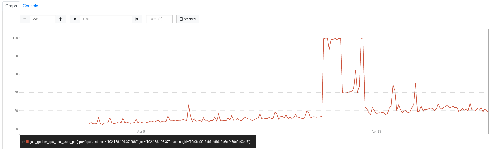
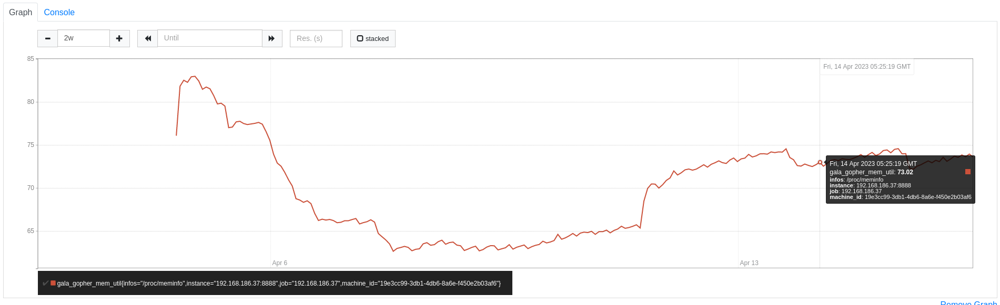

# Система предсказания утилизации центральтного процессора
-------------
### Авторы
* Лопатин Алексей (P4116)
* Денисенков Артем (P4115)

#### Цель 

Автоматизировать процесс прогноза состояния ЦПУ в зависимости от показателей нагрузки других ресурсов сервера.

#### Задачи:
1.  Анализ существующих решений;
2.	Разработка архитектуры системы;
3.	Подготовка исходных данных;
4.	Обучение и оценка моделей регрессии на исходном датасете;
5.	Выбор наиболее оптимальной модели; 
6.	Развертывание наилучшей модели.

#### Характеристика датасета:
Датасет для обучения представлен импортом данных из Timeseriesdb  Prometheus с действующего сервера за период примерно 14 дней с грануляцией сбора метрик в 15 секунд. При этом в данный период на сервере производилось активное нагрузочное тестирование, что отражено на графике ниже.

#### Источники:
* [Датасет](https://github.com/alexshovel/dataset/dataset.tar.gz)
* [Репозиторий проекта](https://github.com/alexshovel/cpu-utilization-prediction)